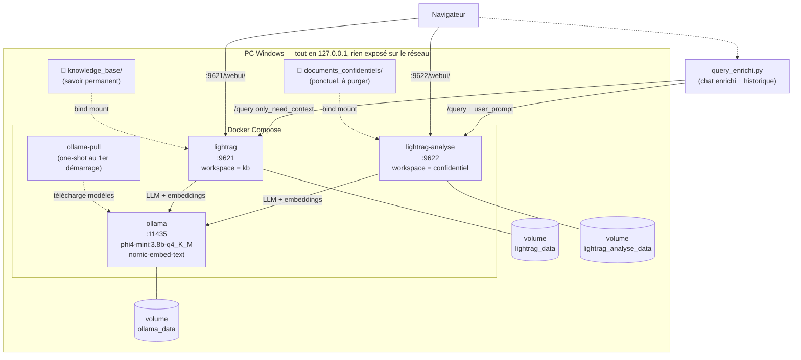
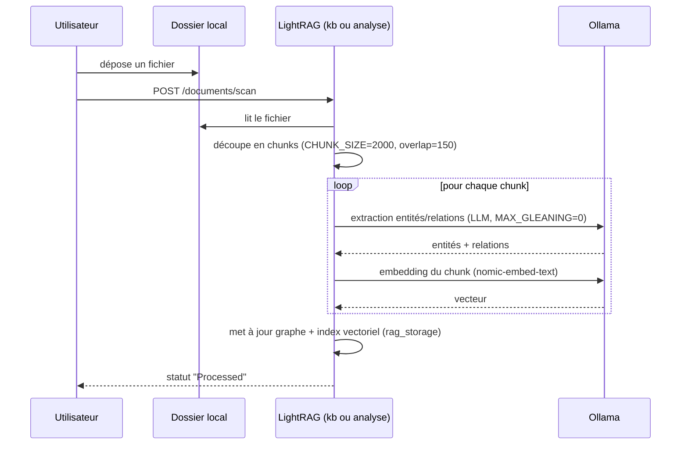
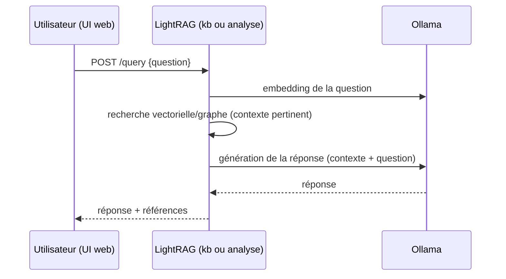
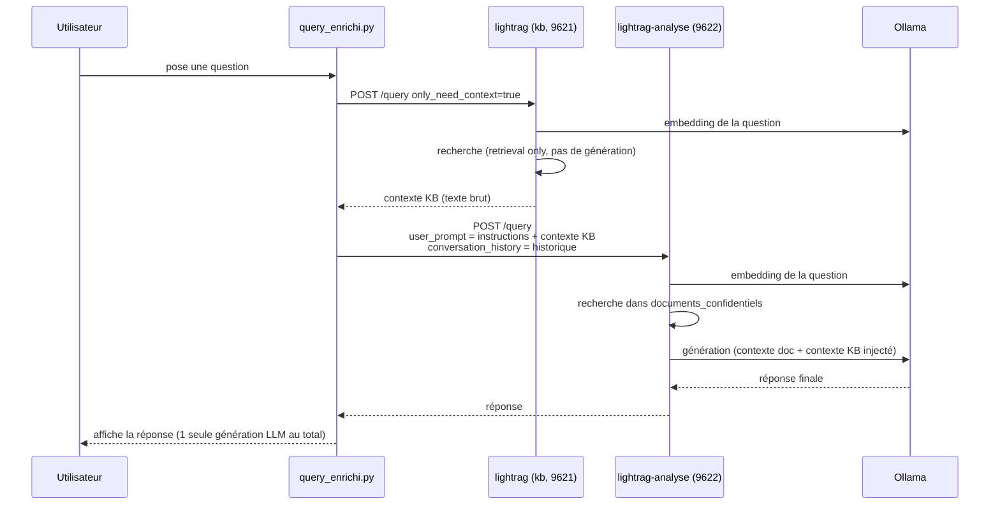

# Architecture du projet

## Schéma statique — composants et stockage

**Points clés d'isolation** : `lightrag` et `lightrag-analyse` sont deux processus séparés, deux volumes séparés, deux workspaces séparés. Rien ne circule automatiquement de l'un vers l'autre — seul `query_enrichi.py` fait le pont, à sens unique (KB → Analyse), et uniquement en mémoire (rien n'est stocké de façon permanente côté Analyse suite à cet enrichissement).

---

## Schéma dynamique — 3 flux

### 1. Indexation d'un document (dépôt → recherchable)

### 2. Question simple (une seule interface, sans croisement)

### 3. Question enrichie (`query_enrichi.py`) — KB + document, 1 seule génération

