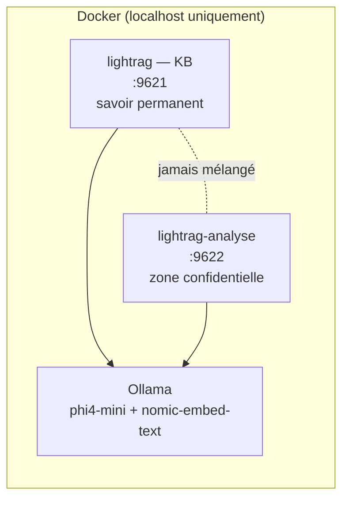

# AssisTHAnt RAG

Assistant de recherche documentaire **100% local**. Aucune donnée ne sort du PC — pas de cloud, pas d'API externe, tout tourne dans Docker.

Deux usages séparés et étanches l'un de l'autre :
- une **base de connaissance permanente** (documents d'entreprise réutilisables)
- une **zone d'analyse ponctuelle** pour des documents sensibles, purgeable après usage, sans jamais polluer la base permanente

---

## Comment ça marche

Le projet fait tourner deux instances [LightRAG](https://github.com/HKUDS/LightRAG) totalement isolées (volumes Docker et workspaces distincts), toutes deux servies par un seul modèle [Ollama](https://ollama.com) local — pas de cloud, pas de clé API.



- **`knowledge_base/`** → indexé sur http://localhost:9621/webui/, reste indéfiniment
- **`documents_confidentiels/`** → indexé sur http://localhost:9622/webui/, à purger après usage (`Purger-Analyse.bat`)
- **`query_enrichi.py`** → pose une question qui croise les deux : recherche le contexte pertinent dans la KB (sans génération, juste une recherche), puis l'injecte dans la réponse générée à partir du document déposé — une seule génération LLM au total, jamais de duplication d'index

Schémas détaillés (composants + séquences d'échange) : [ARCHITECTURE.md](./ARCHITECTURE.md).

---

## Prérequis

- **Docker Desktop** : https://www.docker.com/products/docker-desktop/
- **Python 3** — uniquement pour `query_enrichi.py`
- 8 Go de RAM minimum, ~6 Go d'espace disque

### Windows : fix de performance recommandé

Sans ça, l'indexation peut être anormalement lente (goulot mémoire de la VM WSL2). Une fois, avant le premier lancement :

```powershell
notepad "$env:UserProfile\.wslconfig"
```
```ini
[wsl2]
memory=16GB
processors=8
swap=0
```
```powershell
wsl --shutdown
```
Puis relance Docker Desktop.

---

## Installation

```bash
git clone https://github.com/georgiaclemencon/AssisTHAnt_RAG.git
cd AssisTHAnt_RAG
docker compose up -d
```

Premier lancement : télécharge le modèle LLM (~2,5 Go) et le modèle d'embeddings (~275 Mo) — compte 5 à 15 minutes. Les fois suivantes, ~30 secondes.

Sans terminal : double-clic sur **`Demarrer.bat`**.

---

## Utilisation rapide

| Action | Où |
|---|---|
| Ajouter un document permanent | Dépose dans `knowledge_base/`, scan sur http://localhost:9621/webui/ |
| Analyser un document ponctuel/sensible | Dépose dans `documents_confidentiels/`, scan sur http://localhost:9622/webui/ |
| Question croisant les deux | `python query_enrichi.py` (ou `Query-Enrichi.bat`) |
| Purger la zone d'analyse | `Purger-Analyse.bat` |
| Arrêter | `Arreter.bat` ou `docker compose down` |

Guide complet, dépannage et limites connues : **[GUIDE.md](./GUIDE.md)**.

---

## Limites connues

- Recherche **sémantique**, pas un `grep` — pas de garantie de détecter un motif exact (email, IBAN, clé API...) mot pour mot.
- CPU only : pas de GPU dans cette configuration, temps de réponse dépendant de la taille du document.
- La zone d'analyse n'a par défaut aucune connaissance de la base permanente, sauf via `query_enrichi.py`.

---

## Licence

À définir par le mainteneur du repo avant publication.
