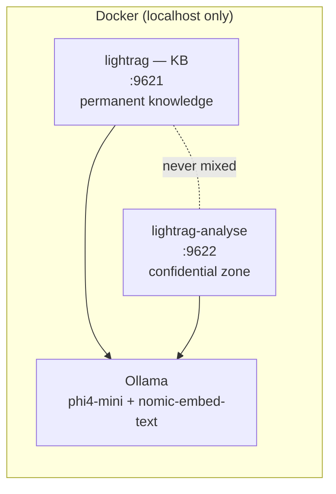

# AssisTHAnt RAG

A **fully local** document search assistant. No data ever leaves the machine — no cloud, no external API, everything runs in Docker.

Two separate, isolated use cases:
- a **permanent knowledge base** for reusable company documents
- a **one-off analysis zone** for sensitive documents, purgeable after use, never mixed into the permanent base

---

## How it works

The project runs two fully isolated [LightRAG](https://github.com/HKUDS/LightRAG) instances (separate Docker volumes and workspaces), both served by a single local [Ollama](https://ollama.com) model — no cloud, no API key.



- **`knowledge_base/`** → indexed at http://localhost:9621/webui/, kept indefinitely
- **`documents_confidentiels/`** → indexed at http://localhost:9622/webui/, purge after use (`Purge-Analysis.bat`)
- **`enriched_query.py`** → asks a question that draws on both: retrieves relevant context from the KB (no generation, just a search), then injects it into the answer generated from the deposited document — a single LLM generation call in total, no duplicated indexing

Detailed diagrams (components + sequence flows): [ARCHITECTURE.md](./ARCHITECTURE.md).

---

## Prerequisites

- **Docker** (see OS-specific instructions below)
- **Python 3** — only needed for `enriched_query.py`
- 8 GB RAM minimum, ~6 GB disk space

### Windows

1. Install **Docker Desktop**: https://www.docker.com/products/docker-desktop/
2. Launch it and wait for the whale icon to go stable in the system tray.

**Recommended performance fix**: without it, indexing can be abnormally slow (a memory bottleneck in the WSL2 VM). Once, before first launch:
```powershell
notepad "$env:UserProfile\.wslconfig"
```
```ini
[wsl2]
memory=16GB
processors=8
swap=0
```
```powershell
wsl --shutdown
```
Then relaunch Docker Desktop.

### Linux

Install Docker Engine + the Compose plugin:
```bash
curl -fsSL https://get.docker.com | sh
sudo usermod -aG docker $USER   # log out/in afterwards
```
Docker Compose v2 ships as the `docker compose` plugin on modern installs — verify with `docker compose version`.

No WSL2-style virtualization layer on Linux — Docker Engine uses host memory directly, so the Windows performance fix above does not apply. Just make sure the host itself has enough free RAM (8 GB+) for the model.

---

## Installation

```bash
git clone https://github.com/georgiaclemencon/AssisTHAnt_RAG.git
cd AssisTHAnt_RAG
docker compose up -d
```

First launch: downloads the LLM (~2.5 GB) and the embedding model (~275 MB) — takes 5 to 15 minutes. Subsequent launches: ~30 seconds.

Without a terminal (Windows): double-click **`Start.bat`**.

---

## Quick usage

| Action | Where |
|---|---|
| Add a permanent document | Drop it in `knowledge_base/`, scan at http://localhost:9621/webui/ |
| Analyze a one-off/sensitive document | Drop it in `documents_confidentiels/`, scan at http://localhost:9622/webui/ |
| Question drawing on both | `python enriched_query.py` (or `Enriched-Query.bat`) |
| Purge the analysis zone | `Purge-Analysis.bat` |
| Stop | `Stop.bat` or `docker compose down` |

Full guide, troubleshooting and known limitations: **[GUIDE.md](./GUIDE.md)**.

---

## Changing the model

The LLM and embedding models are controlled entirely from **`.env`** — no need to touch `docker-compose.yml`.

1. Pick a model available on [Ollama's library](https://ollama.com/library) (any CPU-friendly instruct model works; this repo defaults to `phi4-mini:3.8b-q4_K_M` as a fast/quality balance).
2. Edit `.env`:
   ```ini
   LLM_MODEL=your-model:tag
   ```
3. Restart the stack — the new model is downloaded automatically on next boot:
   ```bash
   docker compose down
   docker compose up -d
   ```

The same applies to the embedding model (`EMBEDDING_MODEL`) — if you change it, re-index existing documents afterward (their vectors were computed with the old embedding space and won't match the new one).

To use LM Studio instead of the bundled Ollama container, see the commented-out "Option 2" block in `.env` (breaks 100%-Docker portability, local dev only).

---

## Known limitations

- **Semantic** search, not `grep` — no guarantee of catching an exact pattern (email, IBAN, API key...) verbatim.
- CPU only: no GPU in this configuration, response time depends on document size.
- The analysis zone has no knowledge of the permanent base by default, except via `enriched_query.py`.

---

## License

To be defined by the repository maintainer before publishing.
