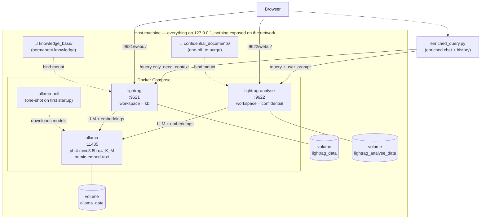
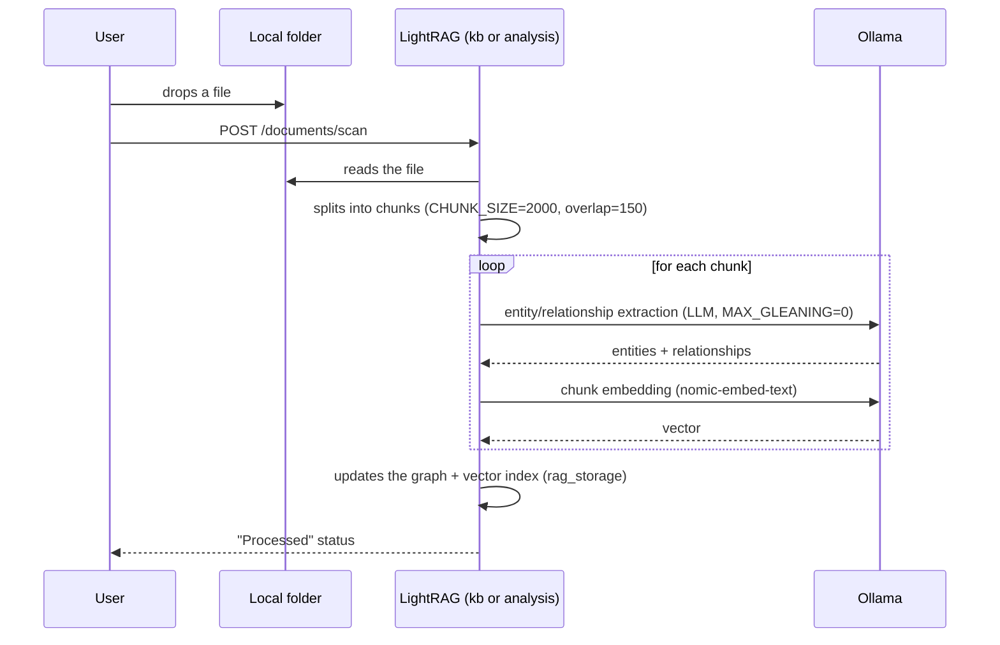
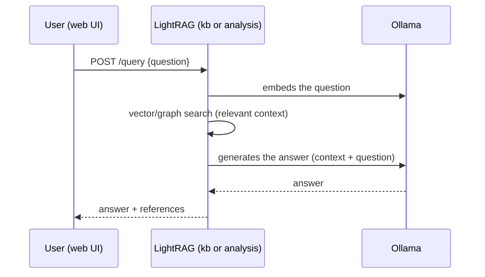
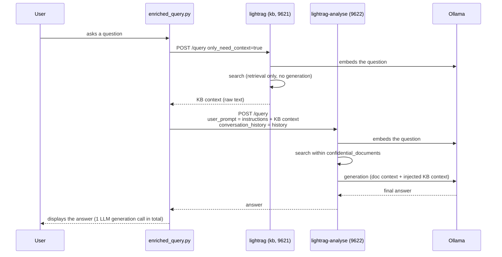

# AssisTHAnt RAG

A **fully local** document search assistant. No data ever leaves the machine — no cloud, no external API, everything runs in Docker.

Two separate, isolated use cases:
- a **permanent knowledge base** for reusable company documents
- a **one-off analysis zone** for sensitive documents, purgeable after use, never mixed into the permanent base

---

## How it works

The project runs two fully isolated [LightRAG](https://github.com/HKUDS/LightRAG) instances (separate Docker volumes and workspaces), both served by a single local [Ollama](https://ollama.com) model — no cloud, no API key.

- **`knowledge_base/`** → indexed at http://localhost:9621/webui/, kept indefinitely
- **`confidential_documents/`** → indexed at http://localhost:9622/webui/, purge after use (`quickusage/Purge-Analysis.bat` / `quickusage/purge-analysis.sh`)
- **`enriched_query.py`** → asks a question that draws on both: retrieves relevant context from the KB (no generation, just a search), then injects it into the answer generated from the deposited document — a single LLM generation call in total, no duplicated indexing

---

## Architecture

### Components and storage



**Key isolation points**: `lightrag` and `lightrag-analyse` are two separate processes, two separate volumes, two separate workspaces. Nothing flows automatically from one to the other — only `enriched_query.py` bridges them, one-way (KB → Analysis), and only in memory (nothing is permanently stored on the Analysis side as a result of this enrichment).

### Flow 1 — Indexing a document (drop → searchable)



### Flow 2 — Simple question (single interface, no cross-referencing)



### Flow 3 — Enriched question (`enriched_query.py`) — KB + document, 1 generation only



---

## Prerequisites
- **Git**
- **Docker** (see OS-specific instructions below)
- **Python 3** — only needed for `enriched_query.py`
- 8 GB RAM minimum, ~6 GB disk space minimum

### Windows

1. Install **Docker Desktop**: https://www.docker.com/products/docker-desktop/
2. Launch it and wait for the whale icon to go stable in the system tray.

**Recommended performance fix**: without it, indexing can be abnormally slow (a memory bottleneck in the WSL2 VM). Once, before first launch:
```powershell
notepad "$env:UserProfile\.wslconfig"
```
```ini
[wsl2]
memory=16GB
processors=8
swap=0
```
```powershell
wsl --shutdown
```
Then relaunch Docker Desktop.

### Linux

Install Docker Engine + the Compose plugin:
```bash
curl -fsSL https://get.docker.com | sh
sudo usermod -aG docker $USER   # log out/in afterwards
```
Docker Compose v2 ships as the `docker compose` plugin on modern installs — verify with `docker compose version`.

No WSL2-style virtualization layer on Linux — Docker Engine uses host memory directly, so the Windows performance fix above does not apply. Just make sure the host itself has enough free RAM (8 GB+) for the model.

---

## Installation

```bash
git clone https://github.com/georgiaclemencon/AssisTHAnt_RAG.git
cd AssisTHAnt_RAG
cp .env.example .env      # Windows: copy .env.example .env
docker compose up -d
```

`.env` is gitignored — it's your local copy of `.env.example`, edit it freely (model choice, etc.) without ever committing it.

First launch: downloads the LLM (~2.5 GB) and the embedding model (~275 MB) — takes 5 to 15 minutes. Subsequent launches: ~30 seconds.

Without a terminal:
- Windows: double-click **`quickusage\Start.bat`**.
- Linux/macOS: `./quickusage/start.sh` (first time only: `chmod +x quickusage/*.sh`).

---

## Quick usage

| Action | Windows | Linux/macOS |
|---|---|---|
| Add a permanent document | Drop it in `knowledge_base/`, scan at http://localhost:9621/webui/ | same |
| Analyze a one-off/sensitive document | Drop it in `confidential_documents/`, scan at http://localhost:9622/webui/ | same |
| Enriched query | `python enriched_query.py` (or `quickusage\Enriched-Query.bat`) | `python3 enriched_query.py` (or `./quickusage/enriched-query.sh`) |
| Purge the analysis zone | `quickusage\Purge-Analysis.bat` | `./quickusage/purge-analysis.sh` |
| Start | `quickusage\Start.bat` | `./quickusage/start.sh` |
| Stop | `quickusage\Stop.bat` or `docker compose down` | `./quickusage/stop.sh` or `docker compose down` |

All scripts in `quickusage/` `cd` back to the project root before running anything, so it's safe to double-click them (or run `./quickusage/xxx.sh`) from inside that subfolder — they don't need `docker-compose.yml` next to them.

---

## Changing the model

The LLM and embedding models are controlled entirely from **`.env`** — no need to touch `docker-compose.yml`.

1. Pick a model available on [Ollama's library](https://ollama.com/library) (any CPU-friendly instruct model works; this repo defaults to `phi4-mini:3.8b-q4_K_M` as a fast/quality balance).
2. Edit `.env`:
   ```ini
   LLM_MODEL=your-model
   ```
3. Restart the stack — the new model is downloaded automatically on next boot:
   ```bash
   docker compose down
   docker compose up -d
   ```

The same applies to the embedding model (`EMBEDDING_MODEL`) — if you change it, re-index existing documents afterward (their vectors were computed with the old embedding space and won't match the new one).

To use LM Studio instead of the bundled Ollama container, see the commented-out "Option 2" block in `.env.example` (breaks 100%-Docker portability, local dev only).

---

## Accepted file formats

LightRAG parses documents through a pluggable **parser engine** (`LIGHTRAG_PARSER`, not overridden in this project's `docker-compose.yml`, so the image's default engine applies). Confirmed baseline, no extra configuration needed:

- **`.txt`**, **`.md`** — plain text / Markdown
- **`.pdf`** — text-based PDFs
- **`.docx`** — Word documents

Depending on the exact image version and parser engine active (`native`, `legacy`, `mineru`, `docling`, …), additional formats may work out of the box — e.g. `.pptx`, `.xlsx`, scanned PDFs/images via OCR. Because this list is version-dependent, check the **authoritative, live list for your exact deployment** rather than trusting a static list:

- Try dropping the file in the WebUI (http://localhost:9621/webui/ or :9622) — unsupported formats are rejected immediately with a clear error.
- Or check the API's OpenAPI docs at http://localhost:9621/docs for the document-routes schema.

If a format you need isn't supported, convert it to `.md`/`.txt`/`.pdf` before dropping it in `knowledge_base/` or `confidential_documents/`.

---

## FAQ

### How do I delete everything?

- **Everything (both instances, all models, full reset)**:
  ```bash
  docker compose down -v
  ```
  `-v` removes the named Docker volumes (`ollama_data`, `lightrag_data`, `lightrag_analyse_data`) — the LLM and embedding models will be re-downloaded on next `up`. This does **not** delete the bind-mounted source folders (`knowledge_base/`, `confidential_documents/`) — remove their contents separately if needed:
  ```bash
  rm -rf knowledge_base/* confidential_documents/*        # Linux/macOS
  ```
  ```powershell
  Remove-Item knowledge_base\*, confidential_documents\* -Recurse -Force   # Windows
  ```
- **Only the confidential analysis zone** (index + optionally the source files, keeps the KB and Ollama untouched): use `quickusage/Purge-Analysis.bat` or `quickusage/purge-analysis.sh` — see [Quick usage](#quick-usage).

### Where are chunks/parsed data stored?

Each LightRAG instance keeps its working data inside its own named Docker volume, mounted at `/app/data` (`WORKING_DIR`), namespaced by its `WORKSPACE` (`kb` or `confidential` — see [docker-compose.yml](./docker-compose.yml)):

- **KV storage** (JSON) — chunked text, LLM/embedding response cache, document status
- **Vector storage** (nano-vectordb) — embeddings for chunks, entities, and relationships
- **Graph storage** (NetworkX / GraphML) — the extracted knowledge graph (entities + relations)

These are the defaults documented by [LightRAG](https://github.com/HKUDS/LightRAG) — file-persisted, in-memory databases, fine for this local single-user setup but not meant for concurrent/production workloads.

The **raw source files** you drop are separate: they live in the bind-mounted `knowledge_base/` and `confidential_documents/` folders (visible directly on the host, not inside a Docker volume).

### What permissions does the container run with (root/rootless)?

The official `ghcr.io/hkuds/lightrag` image's entrypoint **starts as root, fixes ownership on the mounted volumes, then drops privileges to a dedicated non-root `lightrag` user (UID 1000)** before running the server. In practice:
- You don't need to `chmod`/`chown` `knowledge_base/` or `confidential_documents/` yourself — the entrypoint fixes ownership on startup.
- Docker Desktop on Windows runs the daemon inside a WSL2 VM regardless — the "rootless mode" question (relevant for the Docker *daemon* on Linux) doesn't apply there.
- On Linux, this project doesn't require or configure rootless Docker; the default (rootful) Docker Engine daemon is assumed, as installed by `get.docker.com` in the Prerequisites section. Rootless Docker daemon mode is untested here.

### What are the `/app/data` volumes for?

`/app/data` is each LightRAG container's `WORKING_DIR` — where it persists everything described above (KV/vector/graph storage). It's backed by a **named Docker volume** (`lightrag_data` for the KB, `lightrag_analyse_data` for the analysis zone), separate from the bind-mounted `inputs/` subfolder inside it, which is where `knowledge_base/` and `confidential_documents/` are mounted (see `volumes:` in [docker-compose.yml](./docker-compose.yml)). Deleting one of these volumes (`docker volume rm ...`) wipes that instance's index but never touches the other instance or the source files on the host.

---

## Troubleshooting

| Symptom | Likely cause | Fix |
|---|---|---|
| `Error response from daemon: Conflict. The container name "/ollama" (or "/ollama-pull", "/lightrag", "/lightrag-analyse") is already in use` | A leftover container from a previous run (often after the compose project name changed) isn't recognized by `docker compose down` anymore | `docker rm -f ollama ollama-pull lightrag lightrag-analyse` (ignore errors for names that don't exist), then `docker compose up -d` again — no data is lost, models/index live in named volumes, not in the container itself |
| `dependency failed to start: container ollama is unhealthy` | Old healthcheck issue | Already fixed in this project — if it recurs, check `docker compose logs ollama` |
| Document stuck in `Failed` status with `httpx.ReadTimeout` | CPU too slow for the configured timeout (900s) | Re-run a scan (`.../documents/scan`) — LightRAG retries failed documents. If it persists: see the `.wslconfig` fix (Prerequisites) |
| Answers very slow (several minutes) despite little content | WSL2 memory bottleneck | Apply the `.wslconfig` fix (Prerequisites) |
| `"There was an error parsing the body"` error on a manual `curl` request | Accented characters sent directly on the command line | Write the JSON to a file (`--data-binary @file.json`) instead of an inline `-d '...'` |
| The Graph tab is empty in the WebUI | Document not yet `Processed`, or you're looking at the wrong instance (`:9621` = kb, `:9622` = confidential — each has its own graph), or the LLM failed silently during entity extraction | Check document status, confirm you're on the right port, and check `docker compose logs -f lightrag` (or `lightrag-analyse`) for extraction errors |

Logs for a service: `docker compose logs -f lightrag` (or `ollama`, `lightrag-analyse`).

---

## Housekeeping

Local-only project, but a few habits keep it clean and safe over time:

- **Purge the analysis zone after every use.** Sensitive/one-off documents shouldn't linger in `confidential_documents/` or its index longer than the analysis itself — run `quickusage/Purge-Analysis.bat` / `purge-analysis.sh` as soon as you're done (see [FAQ](#how-do-i-delete-everything)).
- **Don't let `knowledge_base/` become a dumping ground.** Only drop documents you actually want searchable long-term; stale or duplicate files degrade retrieval quality and waste re-indexing time if the embedding model changes.
- **Never commit real documents or `.env`.** Both `knowledge_base/*`, `confidential_documents/*`, and `.env` are gitignored on purpose — only `.gitkeep`/`​.env.example` are tracked. Before any `git add`, run `git status` and double-check nothing sensitive slipped in (e.g. a test/leak dataset dropped in a tracked folder by mistake).
- **Clean up dangling Docker state periodically**, especially after renaming the compose project or containers (see [Troubleshooting](#troubleshooting)):
  ```bash
  docker container prune   # remove stopped containers
  docker volume ls         # review volumes before removing any
  ```
  Avoid `docker system prune -a --volumes` on a machine you share with other projects — it removes *all* unused images/volumes, not just this project's.
- **Rotate out old backups/exports** if you ever dump the vector or graph store for debugging — treat those dumps with the same sensitivity as the source documents they were built from (a graph/vector dump of `confidential_documents/` can leak the same information the documents did).

---

## Known limitations

- **Semantic** search, not `grep` — no guarantee of catching an exact pattern (email, IBAN, API key...) verbatim.
- CPU only: no GPU in this configuration, response time depends on document size.
- The analysis zone has no knowledge of the permanent base by default, except via `enriched_query.py`.

---

## License

To be defined by the repository maintainer before publishing.
